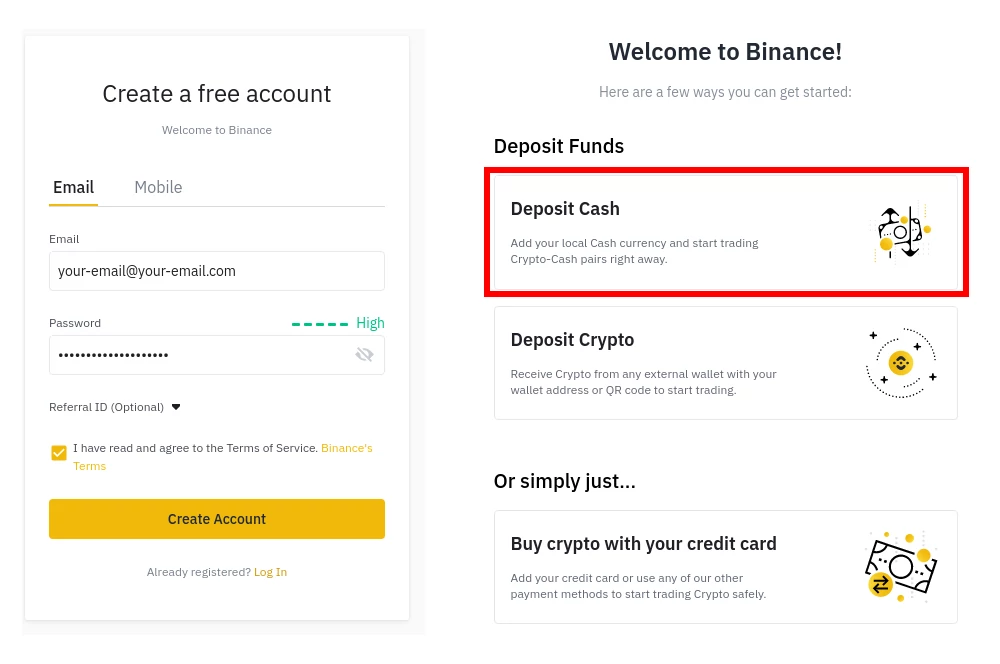
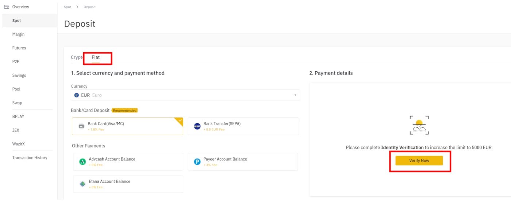
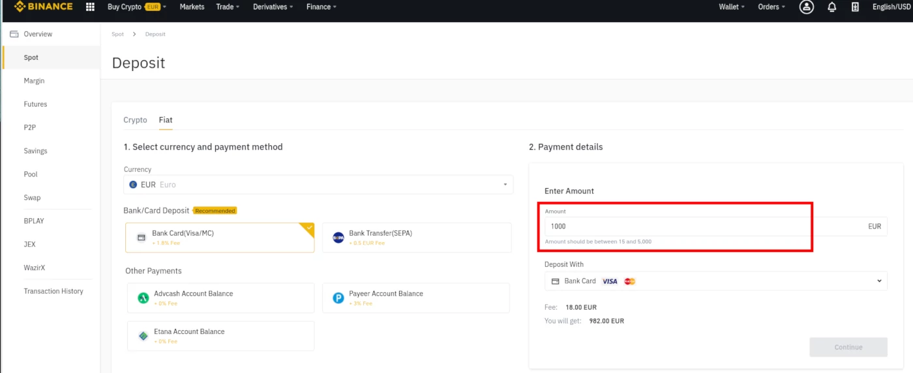
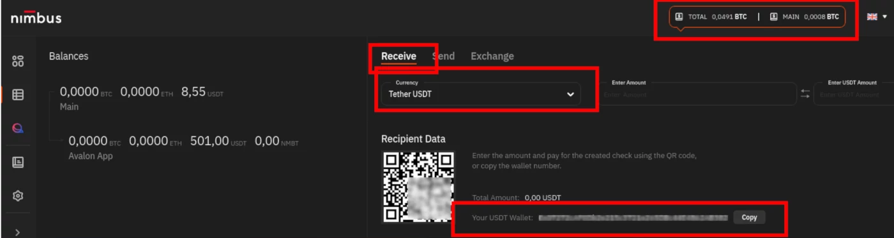
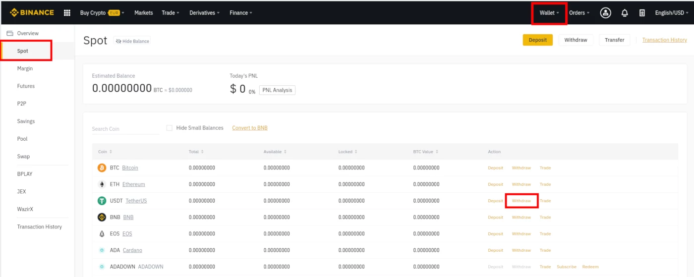

## **The easiest beginner guide to start with  [nimbusplatform.io](https://app.nimbusplatform.io/ref/5V5T0) and get daily returns**
This guide shows you in **few easy steps** how to [create your nimbus platform account](https://app.nimbusplatform.io/ref/5V5T0) and how to start investing on cryptocurrency and get daily returns.

Here are the basic instructions from our investment team to new users, put together and made now **accessible for everybody**.

<em><a href="https://app.nimbusplatform.io/ref/5V5T0" target="_blank">Start here creating your free account</a></em>

... and came back here to follow the instructions to start investing.

## How to start

### Get your cryptocurrency

If you don't have yet any cryptocurrency you can get it easily. You can do it with multiple platforms, our recommendation is to use [binance](https://binance.com) because is easy and cheap.

1. Create your binance account. You can do it for free by clicking [here](https://accounts.binance.com/register)

2. Authenticate yourself following all the steps

3. Buy your first chunk of cryptocurrency following the first login assistant. We recommend to start with Tether USDT. You will be able to pay via bank transfer, credit card and many other payment methods.

From now on, this guide we will assume you are operating with Tether USDT and binance.

### Move your currency to nimbus 

Before making your first deposit you should place the cryptocurrency in the nimbus platform.

1. Go to your nimbus account and click on totals summary in the very top of the page
2. Select Recieve and then in the dropdown select Tether USDT
3. Copy your wallet address labeled 'Your USDT Wallet:'. It starts with 0x...

4. In binance go to Wallet -> Spot and click on 'Withdraw' in the Tether USDT row

5. Paste your nimbus wallet address into the Recipient's USDT Address
6. Select ERC20 network and type your amount

7. Just click submit and wait to have your cryptocurrency in nimbus.

### It's the moment, make your first deposit!

Thats so easy :)
1. Go to your nimbus dashboard and click on the second icon in the left bar 'Marketplace'.
2. Click 'Get Instal' in the **Avalon app**.
3. Select USDT and introduce the amount you want to deposit

4. Click next
5. Click done
6. ... **wait and see the returns coming into your account!**

### Join the community
Do you still have questions? Do you want to get connected to other nimbus investors like you? Join our [community on telegram](https://t.me/nimbusnewbies)!

**Disclaimer**: This page shares a personal experience using this platform and wants to encourage everybody to use it because it has been so beneficial for the ones ho did so. Do it in your own responsibility. What's written here has no warranty and you may reproduce it at your own risk.

We hope this guide has been useful to you. You can also find other resources on the internet and specially youtube.

