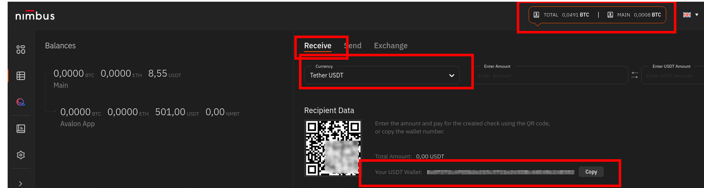
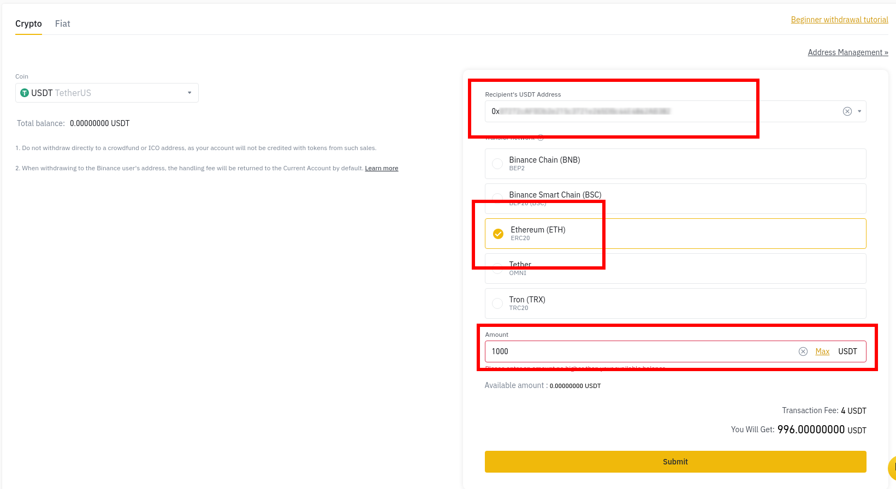

# The esiest guide to start with  [nimbusplatform.io](https://app.nimbusplatform.io/sign-up)
This guide shows you en few easy steps how to start investing cryptocurrency in nimbus platform. Are the basic instructions from our investment team to new users, putted together and made now accessible for everybody.

## Whats nimbus platform

Nimbus is a cryptocurrency investing platform. Nimbus uses trade bots to ensure profitability of our deposits giveing back awesome good returnments. You can see it here from the official documentation (also note the early withdraw fees).

Nimbus uses 3 different cryptocurrencies: Bitcoin, Etherum and Tether(USDT). USDT is special interesting for new users as long it have a fixed value in relation to Dollar.

## How to start

### Start creating your nimbus account

That's so easy, and free. Just go to [sing up at nimbusplatform.io](https://app.nimbusplatform.io/sign-up). You can the this direct link [here](https://app.nimbusplatform.io/sign-up)

### Get your cryptocurrency

If you don't have yet any cryptocurrency you can get it easily. You can do it with multiple platforms, our recomendations is to use [binance](https://binance.com) because is easy and cheap.

1. Create your binance account. You can do it for free by clicking [here](https://accounts.binance.com/register)

2. Authenticate yourself following all the steps

3. Buy your first chunck of cryptocurrency following the first login asistant. We recomend to start with Tether USDT. You will be able to pay via bank transfer, credit card and many other payment methods.

From now on this guide we will asume you are operating with Tether USDT and binance.

### Move your currency to nimbus 

Before making your first diposit you should place the cryptocurrency in the nimbus platform.

1. Go to your nimbus account and click on totals summary in the very top of the page
2. Select Recieve and then in the dropdown select Tether USDT
3. Copy your wallet address labeled 'Your USDT Wallet:'. It starts with 0x...

4. In binance go to Wallet -> Spot and click on 'Withdraw' in the Tether USDT row

5. Paste your nimbus wallet addres into the Recipient's USDT Address
6. Select ERC20 network and type your ammount

7. Just click submit and wait to have your cryptocurrency in nimbus.

### It's the moment, make your first diposit!

Thats so easy :)
1. Go to your nimbus dashboard and click on the second icon in the left bar 'Marketplace'.
2. Click 'Get Instal' in the **Avalon app**.
3. Select USDT and introduce the amount you want to diposit

4. Click next
5. Click done
6. ... wait an see the returns caming into your acount!

**Disclamer**: This page shares a personal experience using this platform and wants to encourage everybody to use it because it have been so beneficial for the ones ho did so. Do it in your own responsability. What's written here has no warranty and you may reproduce it at your own risk.

We hope this guide have been useful to you. You can also find other resources on the internet.

